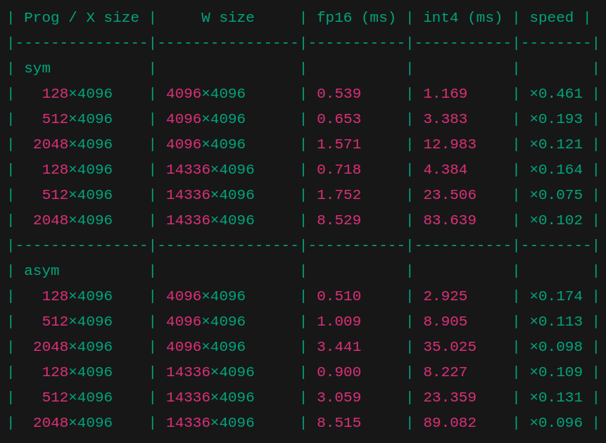
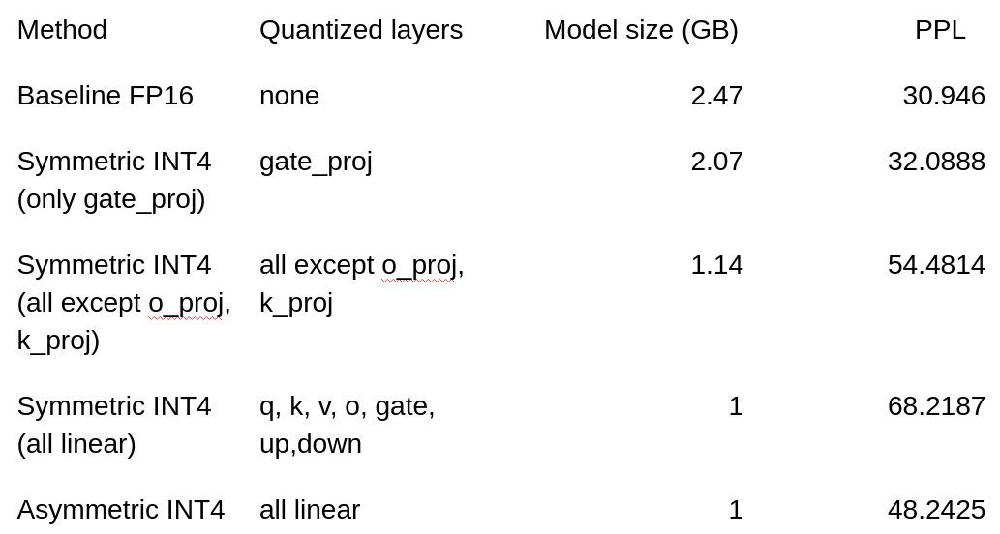

# Quantization helper for Kaggle notebooks

Модуль `quant_lib`, содержит симметричную и асимметричную int4-квантизации с выбором слоёв через `TARGETS`. 
Можно также запускать ноутбуками sym.ipynb asym.ipynb

## Использование в Kaggle/Colab

```bash
pip install git+https://github.com/PeMikj/int4


Пример ноутбука:

```python
!pip install torch==2.3.0 --index-url https://download.pytorch.org/whl/cu121 -qq 
!pip install triton==2.1.0 -qq 
!pip install bitsandbytes==0.41.1 -qq 
!pip install unsloth -qq
!pip install git+https://github.com/PeMikj/int4

import torch
from transformers import AutoTokenizer, AutoModelForCausalLM
from quant_lib import replace_linears_with_quant, DEFAULT_TARGETS

# какие линейные слои квантизировать
TARGETS = {"q_proj", "k_proj", "v_proj", "o_proj", "gate_proj"}

model_name = "unsloth/Llama-3.2-1B-Instruct"
tokenizer = AutoTokenizer.from_pretrained(model_name)
model = AutoModelForCausalLM.from_pretrained(model_name, torch_dtype=torch.float16, device_map="cuda")

# mode="sym" или mode="asym"
replace_linears_with_quant(model, targets=TARGETS, mode="sym")

prompt = "Who is Albert Einstein?"
inputs = tokenizer(prompt, return_tensors="pt").to("cuda")
out = model.generate(**inputs, max_new_tokens=64)
print(tokenizer.decode(out[0], skip_special_tokens=True))
```

Если нужен асимметричный вариант, просто передайте `mode="asym"`. 

## Пример: 3 шага — квантизация → сохранение → перплексия + лог

```python
# 0) Установка (Kaggle)
!pip install torch==2.3.0 --index-url https://download.pytorch.org/whl/cu121 -qq 
!pip install triton==2.1.0 -qq 
!pip install bitsandbytes==0.41.1 -qq 
!pip install unsloth -qq
!pip install git+https://github.com/PeMikj/int4

import csv, datetime
from pathlib import Path
import torch
from transformers import AutoTokenizer, AutoModelForCausalLM
from quant_lib import replace_linears_with_quant, DEFAULT_TARGETS, fast_ppl

# 1) Квантизация
TARGETS = DEFAULT_TARGETS
mode = "sym"  # или "asym"
model_name = "unsloth/Llama-3.2-1B-Instruct"
tokenizer = AutoTokenizer.from_pretrained(model_name)
model = AutoModelForCausalLM.from_pretrained(model_name, torch_dtype=torch.float16, device_map="cuda")
replace_linears_with_quant(model, targets=TARGETS, mode=mode)

# 2) Сохранение
save_dir = Path(f"quantized_model_{mode}")
save_dir.mkdir(exist_ok=True)
model.save_pretrained(save_dir, safe_serialization=True)
tokenizer.save_pretrained(save_dir)

# 3) Перплексия и лог
ppl = fast_ppl(model, tokenizer, batch_size=8, max_tokens=128, limit=5000)
log_path = Path("metrics_log.csv")
row = {
    "timestamp": datetime.datetime.utcnow().isoformat(),
    "model": model_name,
    "quant": mode,
    "targets": ";".join(sorted(TARGETS)),
    "ppl": float(ppl),
    "batch_size": 8,
    "max_tokens": 128,
    "limit": 5000,
}
exists = log_path.exists()
with log_path.open("a", newline="") as f:
    writer = csv.DictWriter(f, fieldnames=row.keys())
    if not exists:
        writer.writeheader()
    writer.writerow(row)
print("PPL:", ppl, "| saved:", save_dir, "| log:", log_path)

```
скорость (сравнение с pytorch)  


замеры перплекии  


